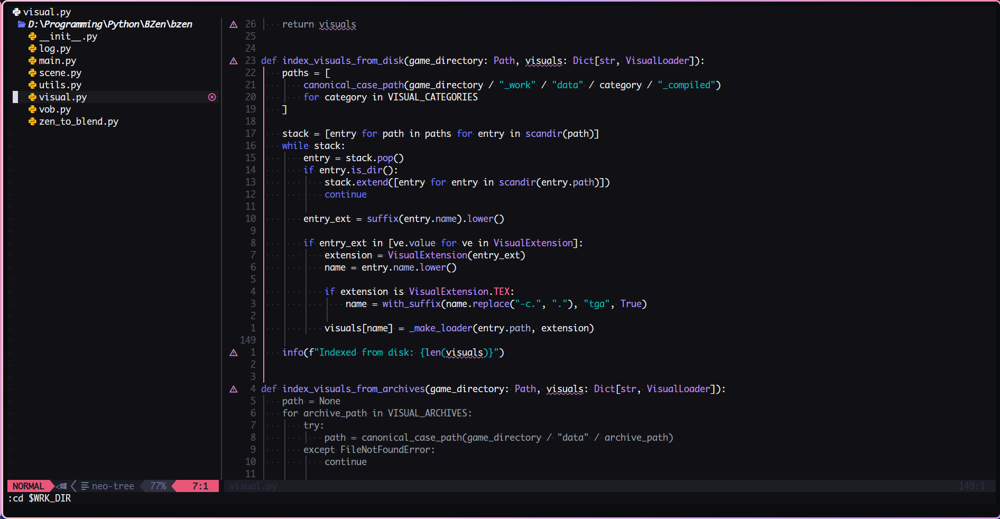
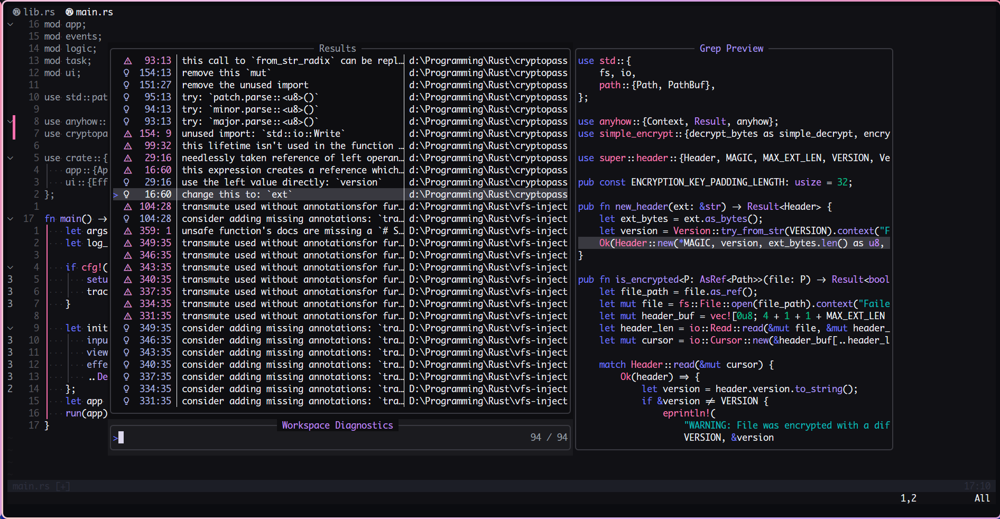

# ultraviolet.nvim

<p align="center">
  <a href="images/1.png">
    
  </a>
  <a href="images/2.png">
    
  </a>
</p>

A dark Neovim colorscheme ported from the [ultraViolet](https://github.com/gurvirr/ultraViolet) Zed theme by Gurvir.  
Deep near-black backgrounds, indigo/violet keywords, periwinkle fields, pink errors, teal strings.

## Palette

| Role         | Hex       | Used for                                      |
|--------------|-----------|-----------------------------------------------|
| `bg`         | `#111115` | Editor background                             |
| `bg_alt`     | `#0E0E11` | Elevated surfaces, float windows             |
| `bg_hi`      | `#393940` | Selection, active line, cursor word           |
| `bg_sub`     | `#1B1B1F` | Hover, inactive elements                      |
| `fg`         | `#F2F4F8` | Primary text                                  |
| `muted`      | `#9AA1AB` | Comments, line numbers, disabled icons        |
| `blue`       | `#6F78FF` | Keywords, statements, titles                  |
| `violet`     | `#AF9CFF` | Functions, methods, constructors              |
| `purple`     | `#C58FFF` | Types, tags, accents                          |
| `lavender`   | `#B3BCEF` | Fields, properties, hints, cyan ANSI slot     |
| `pink`       | `#FF6FAE` | Errors, constants, booleans, variable.builtin |
| `rose`       | `#FF7EB6` | Preprocessor directives                       |
| `green`      | `#08BD8A` | Strings, numbers, success                     |
| `teal`       | `#08BDBA` | String alt, regexp                            |
| `lilac`      | `#E297DB` | Warnings, type.builtin, yellow ANSI slot      |

## Installation

### lazy.nvim
```lua
{
    "Zira3l137/ultraviolet.nvim",
    priority = 1000,
    config = function()
        vim.cmd.colorscheme("ultraviolet")
    end,
}
```

### Manual / local path
```lua
-- lazy.nvim with local dir
{ dir = "/path/to/ultraviolet.nvim", priority = 1000,
  config = function() vim.cmd.colorscheme("ultraviolet") end }
```

## Included highlight groups

- **Base** — all standard Vim/Neovim groups (`Normal`, `Keyword`, `Type`, …)
- **Treesitter** — all `@…` capture groups including `@lsp.type.*` for Rust
- **Telescope** — prompt, results, preview panels
- **Gitsigns** — add / change / delete signs and line blame
- **nvim-cmp** — item kinds and match highlighting
- **indent-blankline** — indent guides
- **which-key** — key popup styling
- **mini.statusline** — mode colours matching the palette
- **mini.cursorword** — word highlight
- **trouble.nvim** — diagnostic list
